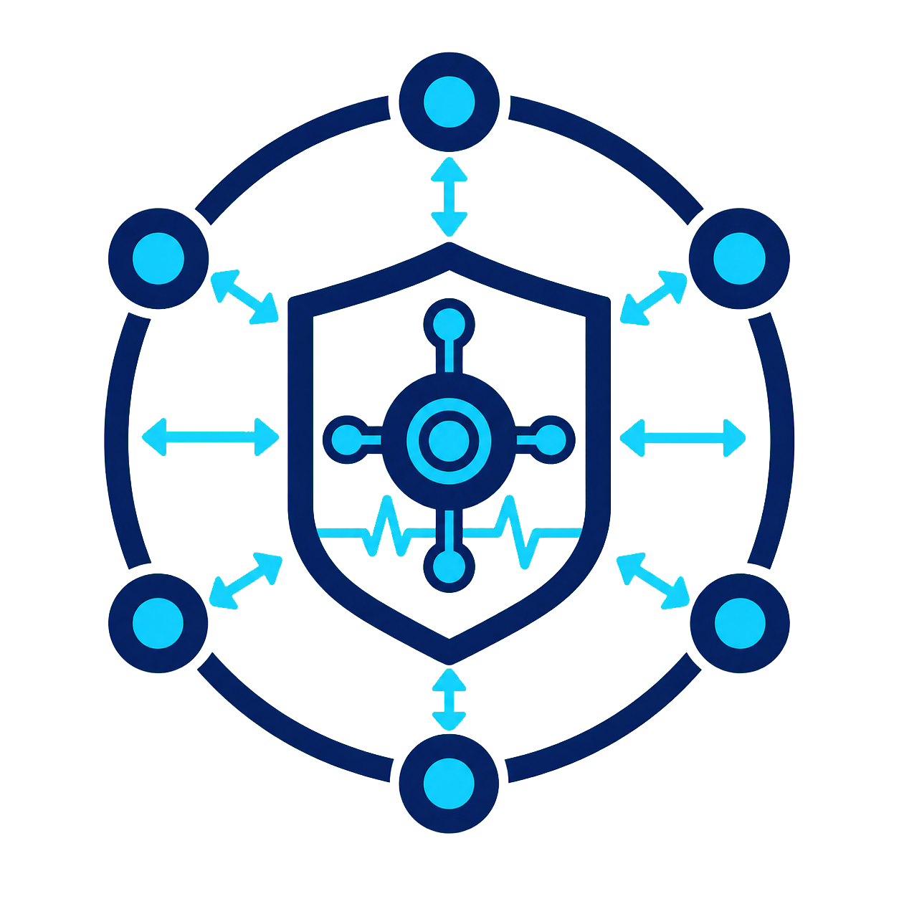
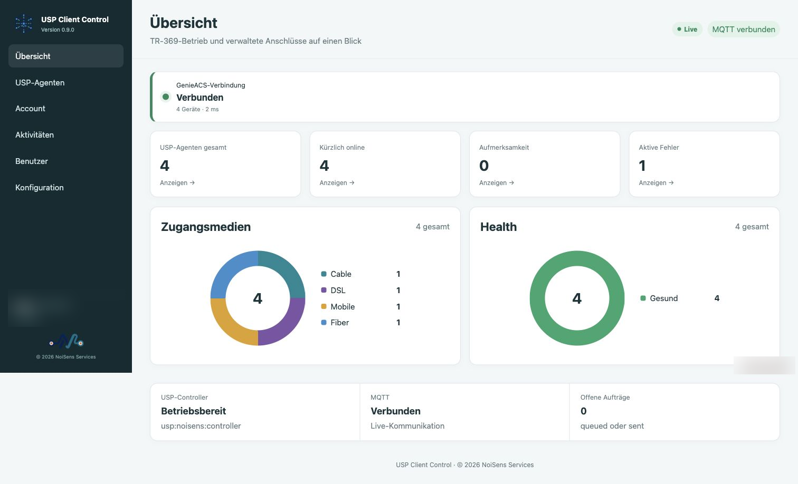
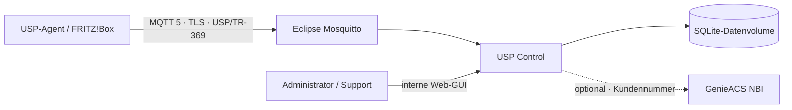

<div align="center">
  
  <h1>USP Control</h1>
  <p><strong>Deutschsprachiger USP-Controller mit moderner TR-369-GUI, MQTT-5-Transport und Live-Geräteansichten.</strong></p>
  <p>
    
    
    
    
    
    
    
  </p>
</div>

**USP Control ist ein eigenständiger USP-/TR-369-Controller mit Web-GUI für die zentrale Verwaltung kompatibler CPEs.** Der Controller verarbeitet standardkonforme USP Records und Messages über MQTT 5, speichert gemeldete Parameter und bereitet technische Gerätedaten für Service und Support übersichtlich auf.

Der Schwerpunkt liegt derzeit auf **AVM FRITZ!Box Cable, DSL, Mobile, Fiber und Ethernet-WAN**. Anschlusswerte, Systemzustand, LAN, WLAN, Clients und vorhandene Spektraldaten werden nicht nur als Rohdaten ausgegeben, sondern in fachlichen Ansichten, Diagrammen, Qualitätsanzeigen und Live-Verläufen dargestellt.

> **Projektstatus: öffentliche Beta, aktiv in Entwicklung.** Die Kernfunktionen arbeiten bereits in einer realen Testumgebung. Wegen modellabhängiger USP-Pfade, unterschiedlicher FRITZ!OS-Freigaben und noch laufender Kompatibilitätstests ist diese Version nicht für einen unbeaufsichtigten Produktivbetrieb freigegeben.

Siehe auch [Changelog](CHANGELOG.md) und [Lizenz](LICENSE.md).

## Einblick



*Aktuelle, datenschutzbereinigte Übersicht mit Controllerstatus, Zugangsmedien und Health-Verteilung.*

## Was USP Control bietet

| Bereich | Funktionen |
| --- | --- |
| **USP-Controller** | MQTT-5-Transport, USP Records/Messages, Agent-Onboarding, Notify- und ValueChange-Verarbeitung |
| **Geräteverwaltung** | Get, Set, Add, Delete, Operate, GetInstances und GetSupportedDM mit Auftragsstatus |
| **Live-Daten** | dynamische Aktualisierung ohne kompletten Seitenneuaufbau, Parameterhistorie und aktuelle Systemwerte |
| **Anschlussqualität** | aufbereitete Cable-, DSL-, Mobile-, Fiber- und Ethernet-WAN-Werte mit Qualitätsbewertung |
| **Spektren & Pegel** | FRITZ!-ähnliche Diagramme für verfügbare DSL-, DOCSIS-, Mobilfunk- und optische Messwerte |
| **WLAN & LAN** | Radios, SSIDs, Kanäle, Clients, Heatmap, Signalqualität, Traffic, Ethernet-Ports und Heimnetzgeräte |
| **System** | Geräteidentität, Firmware, Uptime, CPU, Speicher, Prozesse und weitere gemeldete Betriebswerte |
| **Datenmodell** | vollständige Modellansicht, Suche, Zugriffstypen, Datentypen und sichere Bearbeitung schreibbarer Werte |
| **Benutzer** | Administrator-, Operator- und Viewer-Rolle, eigenes Profil, Kennwortwechsel und Audit-Protokoll |
| **Branding** | USP-Client-Control-Logo, NoiSens-Standardlogo und eigenes Unternehmenslogo per Admin-Konfiguration |
| **GenieACS** | optionale, konfigurierbare Zuordnung von Kundennummern aus einer vorhandenen GenieACS-Installation |

## Rollenmodell

- **Administrator:** Vollzugriff einschließlich Benutzerverwaltung, Integrationen, Live-Profil und Branding
- **Operator:** Geräte lesen, Serviceaktionen ausführen und freigegebene Parameter ändern
- **Viewer:** ausschließlich lesender Zugriff auf Übersichten, Agenten und technische Werte

## Architektur



Der Docker-Stack enthält den Controller, die Weboberfläche, den persistenten Statusspeicher und Eclipse Mosquitto. Die Proto-Klassen werden beim Image-Build aus den mitgelieferten Broadband-Forum-Definitionen erzeugt.

## Voraussetzungen

- Docker Engine mit Docker Compose
- OpenSSL für die initiale Erzeugung lokaler Schlüssel und Kennwörter
- ein internes Managementnetz
- für externe Agenten ein gültiges, vom Endgerät vertrauenswürdiges MQTT-TLS-Zertifikat

## Schnellstart mit Docker Compose

```bash
git clone https://gitlab.noisens.de/nsens/usp-client-control.git
cd usp-client-control
chmod +x deploy-init.sh
./deploy-init.sh
```

Das Initialisierungsskript:

1. erzeugt zufällige Anwendungs-, Administrator- und MQTT-Kennwörter,
2. legt eine lokale `.env` an,
3. erzeugt bei Bedarf ein lokales Testzertifikat,
4. erstellt die Mosquitto-Kennwortdatei und
5. baut und startet den Docker-Stack.

Die initialen Zugangsdaten werden am Ende einmalig im Terminal ausgegeben. Die Weboberfläche ist standardmäßig unter `127.0.0.1:8080` gebunden. Für einen internen Zugriff kann `GUI_BIND_ADDRESS` gezielt auf eine Management-IP gesetzt oder ein interner Reverse Proxy verwendet werden.

> Das automatisch erzeugte selbstsignierte Zertifikat dient nur der technischen Inbetriebnahme. Für reale FRITZ!Box-Agenten muss der MQTT-Endpunkt ein gültiges und vom Gerät akzeptiertes Zertifikat verwenden.

## Zentrale Umgebungsvariablen

| Variable | Standard | Beschreibung |
| --- | --- | --- |
| `APP_SECRET` | automatisch erzeugt | Signaturschlüssel für Websitzungen |
| `ADMIN_USERNAME` | `admin` | initialer Administratorname |
| `ADMIN_PASSWORD` | automatisch erzeugt | initiales Administratorkennwort |
| `CONTROLLER_ENDPOINT_ID` | `usp:example:controller` | USP Endpoint-ID des Controllers |
| `MQTT_CONTROLLER_TOPIC` | `usp/controller` | Eingangs-Topic des Controllers |
| `MQTT_AGENT_TOPIC_TEMPLATE` | `usp/agent/[[EID]]` | Vorlage für Agent-Antworttopics |
| `MQTT_TLS_COMMON_NAME` | `localhost` | Common Name des lokalen Testzertifikats |
| `GUI_BIND_ADDRESS` | `127.0.0.1` | Bind-Adresse der Weboberfläche |
| `MQTT_BIND_ADDRESS` | `0.0.0.0` | Bind-Adresse für MQTT und MQTT/TLS |
| `DATABASE_PATH` | `/data/controller.db` | SQLite-Datenbank im persistenten Volume |

## USP- und FRITZ!OS-Hinweise

Der tatsächlich nutzbare Funktionsumfang hängt vom Agenten, dessen USP-Version, der Firmware und den eingeräumten Controllerrechten ab. Nicht jedes Gerät liefert jeden standardisierten oder herstellerspezifischen Parameter. USP Control zeigt fehlende Messwerte daher nicht als erfundene Ersatzwerte an.

Schreiboperationen können durch das Datenmodell, die Zugriffsrechte des Controllers oder das Providerprofil eingeschränkt sein. Neue Funktionen sollten zunächst mit einem Testgerät geprüft werden.

## Sicherheit

USP Control kann Konfigurationen an verwalteten Endgeräten verändern und gehört in ein geschütztes Managementnetz.

- Weboberfläche nicht direkt aus dem Internet veröffentlichen
- MQTT ausschließlich mit Authentifizierung, ACL und einem gültigen TLS-Zertifikat betreiben
- starke individuelle Kennwörter und restriktive Rollen verwenden
- `.env`, Datenbank, MQTT-Kennwortdateien, private Schlüssel, Gerätedumps und Sicherungen niemals committen
- Firewallzugriffe auf erforderliche Agenten und Administrationsnetze begrenzen
- schreibende Aktionen zuerst an Testgeräten validieren
- das persistente Datenvolume serverseitig sichern

Die Anwendung verwendet HTTP-only-Sitzungscookies, gehashte Benutzerkennwörter, rollenbasierte Berechtigungen und ein Audit-Protokoll. MQTT-Zugangsdaten bleiben in der Serverumgebung und werden nicht an den Browser ausgegeben.

## Mitwirken und Fehler melden

Fehlerberichte und nachvollziehbare Verbesserungsvorschläge sind willkommen. Bitte keine produktiven Gerätedumps, Endpoint-IDs, Seriennummern, Kundennummern, Zugangsdaten, öffentlichen IP-Adressen oder vollständigen Ereignisprotokolle in Issues veröffentlichen. Für Beispiele ausschließlich anonymisierte Daten verwenden.

## Lizenz und Copyright

Copyright © 2026 NoiSens Services.

Die Software darf kostenlos privat und kommerziell genutzt sowie ausschließlich in unveränderter Form weitergegeben werden. Änderungen, Bearbeitungen und abgeleitete Werke sind nicht gestattet. Laufzeitkonfigurationen über die vorgesehenen Einstellungen und Umgebungsvariablen bleiben erlaubt.

Es handelt sich um **Source-available Software, nicht um Open Source**. Maßgeblich ist die vollständige [NoiSens No-Derivatives Software License 1.0](LICENSE.md).
